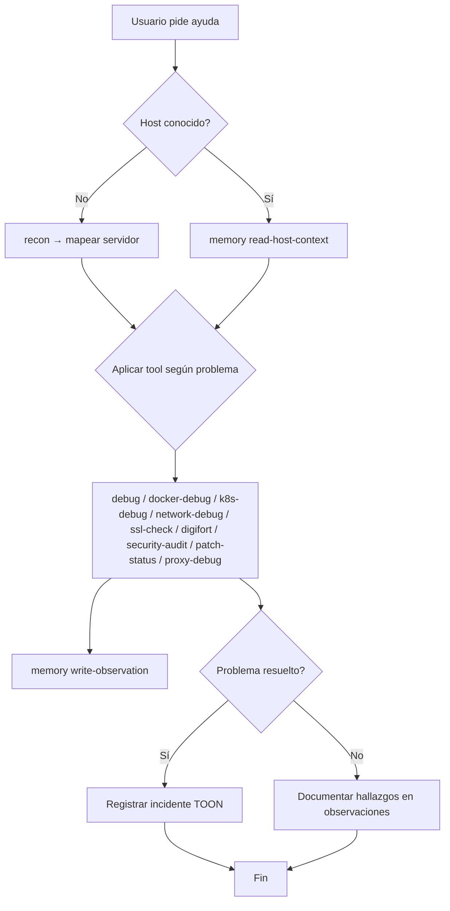

<p align="center">
  
</p>

<h1 align="center">🛠️ Sysadmin AI Ecosystem</h1>

<p align="center">
  <b>Un ecosistema de herramientas inteligentes para administración de servidores · <a href="https://opencode.ai">OpenCode</a></b>
</p>

<p align="center">
  
  
  
  
</p>

---

## 📋 Tabla de Contenidos

- [Descripción General](#-descripción-general)
- [Arquitectura](#-arquitectura)
- [Tools Disponibles](#-tools-disponibles)
  - [debug](#-debug)
  - [recon](#-recon)
  - [k8s-debug](#-k8s-debug)
  - [docker-debug](#-docker-debug)
  - [network-debug](#-network-debug)
  - [ssl-check](#-ssl-check)
  - [digifort](#-digifort)
  - [security-audit](#-security-audit)
  - [patch-status](#-patch-status)
  - [proxy-debug](#-proxy-debug)
  - [memory](#-memory)
- [Memoria Persistente (TOON)](#-memoria-persistente-toon)
- [Migración desde Markdown](#-migración-desde-markdown)
- [Flujo de Trabajo](#-flujo-de-trabajo)
- [Instalación](#-instalación)
  - [Requisitos](#requisitos)
  - [Setup rápido](#setup-rápido)
- [Ejemplos de Uso](#-ejemplos-de-uso)
- [Skills](#-skills)
- [Roadmap](#-roadmap)
- [Contribuir](#-contribuir)
- [Licencia](#-licencia)

---

## 🚀 Descripción General

**Sysadmin AI Ecosystem** es un conjunto de herramientas (tools + skills) para [OpenCode](https://opencode.ai) que convierte a un asistente de IA en un **ingeniero de sistemas autónomo** capaz de:

- 🔍 Diagnosticar servidores remotos vía SSH
- 🐳 Inspeccionar contenedores Docker y orquestación Kubernetes
- 🌐 Analizar problemas de conectividad y red
- 🔐 Verificar certificados SSL/TLS
- 📹 Consultar servidores Digifort (NVR) — uso, cámaras, estado de grabación
- 🛡️ Auditar seguridad con Lynis — hardening index, warnings, suggestions
- 📦 Estado de parches y actualizaciones — paquetes pendientes, seguridad, compatibilidad
- 🌐 Diagnóstico de reverse proxies — nginx/apache/caddy/traefik/haproxy, config, logs de error, 5xx/4xx
- 🧠 Mantener **memoria persistente** de cada servidor e incidentes

Todo **read-only** y **sin sudo** — seguro para entornos de producción.

---

## 🏗️ Arquitectura

```
sysadmin-ai-ecosystem/
├── AGENTS.md                      ← Reglas de selección automática de tools
├── .env.example                   ← Template de credenciales (Digifort)
├── ssh-keys/                      ← Claves SSH (auto-detectadas)
│   ├── id_ed25519
│   └── id_ed25519.pub
├── memoria/                       ← Memoria persistente (TOON)
│   ├── entities/hosts/            ← Estado consolidado hosts
│   ├── entities/services/         ← Estado consolidado servicios
│   ├── entities/clusters/         ← Estado consolidado clusters
│   ├── events/observations/       ← Observaciones históricas
│   ├── events/incidents/          ← Incidentes
│   ├── events/changes/            ← Cambios aplicados
│   ├── views/host-context/        ← Vista compacta para IA
│   ├── schemas/                   ← Contratos TOON
│   ├── hosts/                     ← [legacy] Markdown
│   └── incidentes/                ← [legacy] Markdown
└── .opencode/
    ├── package.json               ← Dependencias npm
    ├── node_modules/              ← @toon-format/toon
    ├── tools/                     ← Tools custom (TypeScript)
    │   ├── _ssh.ts                ← Helper SSH compartido
    │   ├── _memory.ts             ← Helper memoria TOON
    │   ├── memory.ts              ← Tool de gestión de memoria
    │   ├── debug.ts
    │   ├── recon.ts
    │   ├── docker-debug.ts
    │   ├── k8s-debug.ts
    │   ├── network-debug.ts
    │   ├── ssl-check.ts
    │   ├── digifort.ts            ← HTTP directo (sin SSH)
    │   ├── security-audit.ts      ← Lynis security audit
    │   ├── patch-status.ts        ← Package updates status
    │   └── proxy-debug.ts         ← Reverse proxy debug
    └── skills/
        ├── host-memory/
        │   └── SKILL.md           ← Skill de gestión de memoria
        ├── security-audit/
        │   └── SKILL.md
        ├── patch-status/
        │   └── SKILL.md
        └── proxy-debug/
            └── SKILL.md
```

### ⚙️ Cómo funciona

```
Usuario → "chequeá el servidor 192.168.1.50 que está lento"
         │
         ▼
    [AGENTS.md] → deduce: usa debug
         │
         ▼
    [memory read-host-context host=192.168.1.50] → contexto TOON
         │
         ▼
    [debug.ts] → SSH a 192.168.1.50, comandos read-only
         │
         ▼
    [memory write-observation] → guarda hallazgos en TOON
```

---

## 🧰 Tools Disponibles

Cada tool se conecta por SSH al servidor, auto-detecta la clave en `ssh-keys/`, ejecuta comandos read-only y devuelve la información estructurada.

### 🔬 debug

Diagnóstico general del servidor. Sistemas, recursos, puertos y logs.

| Parámetro | Tipo | Descripción |
|-----------|------|-------------|
| `host` | `string` | Servidor remoto |
| `port` | `number?` | Puerto SSH (22) |
| `username` | `string?` | Usuario SSH |
| `service` | `string?` | Servicio systemd a inspeccionar |

**Salida:** Kernel, uptime, OS, memoria, disco, load average, top procesos, puertos TCP, journald (50 líneas), servicios fallados. Si se especifica `service`: status + últimos logs.

### 🗺️ recon

Reconocimiento completo del servidor. Descubre qué está corriendo y cómo está configurado.

| Parámetro | Tipo | Descripción |
|-----------|------|-------------|
| `host` | `string` | Servidor remoto |
| `port` | `number?` | Puerto SSH (22) |
| `username` | `string?` | Usuario SSH |

**Salida:** OS, systemd activos, top procesos, TCP/UDP listeners, Docker, Podman, k8s, versiones de runtimes (Node/Python/Go/Java/nginx/PostgreSQL/Redis), config de nginx/apache/caddy, directorios de apps, healthchecks locales.

### ☸️ k8s-debug

Depuración de clústeres Kubernetes. Requiere `kubectl` configurado en el host remoto.

| Parámetro | Tipo | Descripción |
|-----------|------|-------------|
| `host` | `string` | Host con kubectl configurado |
| `port` | `number?` | Puerto SSH (22) |
| `username` | `string?` | Usuario SSH |
| `namespace` | `string?` | Filtrar por namespace |
| `pod` | `string?` | Pod específico (requiere namespace) |

**Salida:** Nodos, namespaces, pods (wide), deployments, statefulsets, daemonsets, services, ingress, eventos ordenados, logs (con `--previous`), restart count, `top pods/nodes`.

### 🐳 docker-debug

Depuración de contenedores Docker.

| Parámetro | Tipo | Descripción |
|-----------|------|-------------|
| `host` | `string` | Servidor con Docker |
| `port` | `number?` | Puerto SSH (22) |
| `username` | `string?` | Usuario SSH |
| `container` | `string?` | Container específico |

**Salida:** `docker ps -a`, `stats --no-stream`, imágenes, redes, volúmenes. Si se especifica `container`: inspect, health, restart count, mounts, puertos publicados, logs.

### 🌐 network-debug

Diagnóstico de conectividad desde el servidor.

| Parámetro | Tipo | Descripción |
|-----------|------|-------------|
| `host` | `string` | Servidor para ejecutar tests |
| `target` | `string` | Destino a testear |
| `port` | `number?` | Puerto SSH (22) |
| `username` | `string?` | Usuario SSH |
| `targetPort` | `number?` | Puerto destino para HTTP/probes |
| `test` | `string?` | Tipo: `all`, `ping`, `dns`, `traceroute`, `mtr`, `http`, `ports` |

**Salida:** IPs locales, ruteo, ping, DNS (directo + reverso), traceroute, MTR, HTTP/HTTPS, conexiones activas, escaneo de puertos vía `/dev/tcp`.

### 🔒 ssl-check

Verificación de certificados SSL/TLS.

| Parámetro | Tipo | Descripción |
|-----------|------|-------------|
| `host` | `string` | Servidor para ejecutar el check |
| `target` | `string` | Hostname a verificar |
| `port` | `number?` | Puerto SSH (22) |
| `username` | `string?` | Usuario SSH |
| `targetPort` | `number?` | Puerto HTTPS (443) |
| `sni` | `string?` | SNI (default: target) |

**Salida:** Fechas, subject, issuer, serial, fingerprint SHA-256, SANs, chain, verificación, ventanas de expiración (30/90 días), soporte TLS 1.2 y 1.3.

### 📹 digifort

Consulta el estado de un servidor Digifort (NVR) vía HTTP directo (no SSH). Lee credenciales de `.env` (`DIGIFORT_USER`, `DIGIFORT_PASS`) o permite pasarlas por parámetro.

| Parámetro | Tipo | Descripción |
|-----------|------|-------------|
| `host` | `string` | IP del servidor Digifort |
| `port` | `number?` | Puerto HTTP (8601) |
| `username` | `string?` | Usuario (default: DIGIFORT_USER del .env) |
| `password` | `string?` | Password (default: DIGIFORT_PASS del .env) |
| `action` | `string?` | `usage`, `cameras`, `cameras-status`, `all` (default) |
| `filter` | `string?` | Filtro por nombre/IP/descripción de cámara |

**Salida:**
- **usage** — CPU, memoria, tráfico, conexiones activas del servidor
- **cameras** — listado con nombre, IP, puerto y estado activa/inactiva
- **cameras-status** — estado de grabación: ok/falla, uptime, horas de grabación, disco usado
- **filter** — sin filter muestra solo cantidad + 5; con filter, todas las coincidencias

### 🛡️ security-audit

Ejecuta Lynis security audit en el servidor remoto. Descarga Lynis a `/tmp` si no está instalado. Read-only, sin sudo.

| Parámetro | Tipo | Descripción |
|-----------|------|-------------|
| `host` | `string` | Servidor remoto |
| `port` | `number?` | Puerto SSH (22) |
| `username` | `string?` | Usuario SSH |
| `identityFile` | `string?` | Clave SSH (auto-detectada) |
| `mode` | `string?` | `quick` (default, resumen) o `full` (reporte completo) |

**Salida (quick):** Hardening Index, cantidad de warnings/suggestions, top 10 de cada uno.
**Salida (full):** Reporte Lynis completo (formato key=value).

### 📦 patch-status

Estado de parches y actualizaciones del servidor. Detecta apt (Debian/Ubuntu), dnf (Fedora/RHEL) y yum (CentOS 7).

| Parámetro | Tipo | Descripción |
|-----------|------|-------------|
| `host` | `string` | Servidor remoto |
| `port` | `number?` | Puerto SSH (22) |
| `username` | `string?` | Usuario SSH |
| `identityFile` | `string?` | Clave SSH (auto-detectada) |
| `mode` | `string?` | `summary` (default), `full`, `security` |

**Salida (summary):** OS y package manager, total updates (security vs regular), reboot pending, paquetes que se eliminarían, held/orphaned, top 10 security updates.
**Salida (full):** Listado completo de paquetes upgradables, simulated dist-upgrade, held, orphaned.
**Salida (security):** Solo los paquetes con update de seguridad.

### 🌐 proxy-debug

Diagnóstico de reverse proxies. Detecta automáticamente nginx, apache, caddy, traefik, haproxy y extrae configuración, logs de error y resumen de 5xx/4xx.

| Parámetro | Tipo | Descripción |
|-----------|------|-------------|
| `host` | `string` | Servidor remoto |
| `port` | `number?` | Puerto SSH (22) |
| `username` | `string?` | Usuario SSH |
| `identityFile` | `string?` | Clave SSH (auto-detectada) |
| `mode` | `string?` | `auto` (default), `config`, `logs`, `full` |
| `proxy` | `string?` | Forzar proxy específico: `nginx`, `apache`, `caddy`, `traefik`, `haproxy` |

**Salida (auto):** Proxy + versión, syntax check, server names/puertos clave, últimas 10 líneas de error log, resumen 4xx/5xx.
**Salida (config):** Config extract puro (listen, server_name, proxy_pass, VirtualHost, etc.).
**Salida (logs):** Error log + resumen access log.
**Salida (full):** Todo sin resumir.

### 🧠 memory

Gestión de memoria persistente en formato TOON. Lee/escribe observaciones, consolida entidades y genera vistas compactas para la IA.

| Parámetro | Tipo | Descripción |
|-----------|------|-------------|
| `action` | `string` | `init`, `read-host-context`, `write-observation`, `compact-host`, `render-host-context`, `stale`, `conflicts` |
| `host` | `string?` | Hostname o IP (requerido para la mayoría de acciones) |
| `observations` | `string?` | JSON array de observaciones (requerido para `write-observation`) |

**Acciones:**
- **init** — crea carpetas `entities/`, `events/`, `views/`, `schemas/`
- **read-host-context** — devuelve el contexto TOON del host (vista compacta para IA)
- **write-observation** — guarda observaciones, consolida entidad, regenera vista
- **compact-host** — reconstruye entidad desde observaciones de la semana actual
- **render-host-context** — regenera la vista de contexto
- **stale** — lista facts vencidos de un host
- **conflicts** — lista contradicciones detectadas (servicio activo pero puerto cerrado, etc.)

---

## 🧠 Memoria Persistente (TOON)

La memoria canónica usa **TOON** (Token-Oriented Object Notation), un formato compacto para LLMs. Reemplaza al Markdown legacy como fuente de verdad.

### Arquitectura

```
memoria/
├── entities/hosts/<host>.toon      ← estado consolidado del host
├── entities/services/<svc>.toon     ← estado consolidado de servicios
├── entities/clusters/<cls>.toon     ← estado consolidado de clusters
├── events/observations/<week>.toon  ← observaciones históricas (append)
├── events/incidents/<id>.toon       ← incidentes
├── events/changes/<id>.toon         ← cambios aplicados
├── views/host-context/<host>.toon   ← vista compacta para IA (leer esto)
└── schemas/*.toon                   ← contratos TOON
```

**Principios:**
- **events/** = historial append-only — nunca se borra
- **entities/** = estado consolidado actual — se actualiza por merge
- **views/** = contexto generado para consumo rápido de la IA
- **schemas/** = contratos TOON con descripción de tablas y campos

### Flujo de datos

```
Tool (debug/recon/etc.)
    │
    ▼
memory write-observation → events/observations/   (historial raw)
    │
    ▼
                        → entities/hosts/<host>.toon  (consolidación por merge)
    │
    ▼
                        → views/host-context/<host>.toon  (vista IA)
```

### Ejemplo: Host entity (TOON)

```toon
schema: sysadmin.host-profile.v1
entity: host:192.168.1.50
host: 192.168.1.50
hostname: web-prod-01
last_seen: 2026-06-12T14:22:00-03:00

roles[2]: reverse-proxy,app-host

services[2]{name,status,enabled,port,source,observed_at,confidence,ttl_days}:
  nginx,active,true,443,recon,2026-06-12T14:22:00-03:00,0.96,7
  docker,active,true,,debug,2026-06-12T14:22:00-03:00,0.94,14

facts[2]{key,value,source,observed_at,confidence,ttl_days}:
  os.name,Ubuntu,recon,2026-06-12T14:22:00-03:00,0.98,30
  disk.root.usage_percent,82,debug,2026-06-12T14:22:00-03:00,0.98,3

known_risks[1]{id,severity,summary,status,source,observed_at,confidence,ttl_days}:
  disk_root_high,warning,"root filesystem above 80%",open,debug,2026-06-12T14:22:00-03:00,0.90,3
```

### Ejemplo: Host context view (TOON — lo que lee la IA)

```toon
schema: sysadmin.host-context.v1
entity: host:192.168.1.50
generated_at: 2026-06-12T15:00:00-03:00

summary:
  health: warning
  role: reverse-proxy + app-host
  reason: root filesystem above 80%

current_services[2]{name,status,port,last_seen}:
  nginx,active,443,2026-06-12T14:22:00-03:00
  docker,active,,2026-06-12T14:22:00-03:00

open_risks[1]{id,severity,summary,last_seen}:
  disk_root_high,warning,"root filesystem above 80%",2026-06-12T14:22:00-03:00

recommended_next_tools[2]: disk-debug,service-debug
```

### Legacy Markdown

Los archivos `memoria/hosts/*.md` e `memoria/incidentes/*.md` **NO se borran**. Se mantienen como fallback para hosts sin contexto TOON. La IA lee views/ primero; si no existe, cae a Markdown.

---

## 🔄 Flujo de Trabajo



---

## ⚡ Instalación

### Requisitos

- [OpenCode](https://opencode.ai) instalado (`npm install -g @opencode-ai/cli` o vía Bun)
- **SSH agent** cargado con la clave (si tiene passphrase):
  ```bash
  eval $(ssh-agent) && ssh-add ~/.ssh/id_ed25519
  ```
- **Opcional**: Archivo `.env` con `DIGIFORT_USER` y `DIGIFORT_PASS` para la tool `digifort`
- **Opcional**: `sshpass` para autenticación por password:
  ```bash
  sudo apt install sshpass   # Debian/Ubuntu
  brew install sshpass       # macOS
  ```

### Setup rápido

```bash
git clone <repo-url> && cd sysadmin-ai-ecosystem

# Poner tus claves SSH
cp ~/.ssh/id_ed25519 ssh-keys/

# Configurar credenciales Digifort (opcional)
cp .env.example .env   # y editá DIGIFORT_USER / DIGIFORT_PASS

# Abrir opencode
opencode
```

---

## 💡 Ejemplos de Uso

| Qué decís | Qué hace la IA |
|-----------|---------------|
| *"chequeá el estado del servidor 10.0.0.5"* | `debug(host: "10.0.0.5")` → muestra recursos, puertos, logs |
| *"explorá el servidor nuevo 192.168.1.100"* | `recon(host: "192.168.1.100")` → mapea servicios y runtimes |
| *"el contenedor de redis no responde en el server db1"* | `docker-debug(host: "db1", container: "redis")` → logs, health, stats |
| *"no llego desde el server web1 a la API en api.internal:443"* | `network-debug(host: "web1", target: "api.internal", targetPort: 443)` |
| *"verificá el certificado de ejemplo.com desde el server proxy1"* | `ssl-check(host: "proxy1", target: "ejemplo.com")` |
| *"los pods en producción están reiniciando"* | `k8s-debug(host: "master1", namespace: "prod")` |
| *"cómo está el NVR 10.10.10.10"* | `digifort(host: "10.10.10.10")` → usage + cameras + status |
| *"mostrame solo la cámara de la entrada"* | `digifort(host: "10.10.10.10", action: "cameras", filter: "entrada")` |
| *"auditá la seguridad del server 10.0.0.5"* | `security-audit(host: "10.0.0.5")` → hardening index + warnings + suggestions |
| *"dame el reporte completo de lynis del server db1"* | `security-audit(host: "db1", mode: "full")` |
| *"qué updates hay pendientes en el server web1"* | `patch-status(host: "web1")` → resumen + security |
| *"mostrame solo los security updates del server app1"* | `patch-status(host: "app1", mode: "security")` |
| *"el proxy no responde, da 502"* | `proxy-debug(host: "proxy1")` → syntax check + errores + 5xx |
| *"revisá la config de apache en web1"* | `proxy-debug(host: "web1", mode: "config", proxy: "apache")` |
| *"guardá el estado actual del server 10.0.0.5"* | `memory action=write-observation host=10.0.0.5 observations=<JSON>` |
| *"qué sabe la memoria sobre db1"* | `memory action=read-host-context host=db1` |
| *"inicializá la memoria"* | `memory action=init` |

---

## 📦 Migración desde Markdown

La memoria canónica del proyecto migró de Markdown (`memoria/hosts/*.md`) a **TOON** (`memoria/entities/hosts/*.toon`).

**Qué cambió:**
- Memoria canónica → TOON (formato compacto para LLMs)
- La IA lee `views/host-context/*.toon` en lugar de `hosts/*.md`
- Las observaciones se guardan con `memory write-observation`
- El historial queda en `events/observations/` (append-only)

**Qué NO cambió:**
- Los archivos `memoria/hosts/*.md` NO se borran
- La IA puede caer a Markdown si no hay contexto TOON
- Las tools existentes siguen funcionando sin cambios
- La falla de memoria no rompe el diagnóstico

**Para migrar datos existentes:**

```bash
opencode
> memory action=init
# Luego, para cada host con Markdown legacy:
> memory action=compact-host host=<ip>
```

---

## 📜 Skills

| Skill | Descripción |
|-------|-------------|
| [host-memory](.opencode/skills/host-memory/SKILL.md) | Gestión de memoria TOON + fallback Markdown. Incluye lectura de contexto y escritura de observaciones |
| [security-audit](.opencode/skills/security-audit/SKILL.md) | Cuándo y cómo ejecutar auditorías Lynis, interpretar resultados, persistir hallazgos |
| [patch-status](.opencode/skills/patch-status/SKILL.md) | Evaluación de actualizaciones pendientes, compatibilidad y riesgos de upgrade |
| [proxy-debug](.opencode/skills/proxy-debug/SKILL.md) | Diagnóstico de reverse proxies, interpretación de errores comunes |

---


## 🗺️ Roadmap

- [x] **`digifort`** — consulta de servidores Digifort NVR (uso, cámaras, estado de grabación)
- [x] **`security-audit`** — auditoría de seguridad con Lynis
- [x] **`patch-status`** — estado de parches y actualizaciones
- [x] **`proxy-debug`** — diagnóstico de reverse proxies
- [x] **`memory`** — memoria persistente TOON con lectura/escritura/consolidación
- [ ] **`db-query`** — consultas SQL read-only a PostgreSQL/MySQL
- [ ] **`ansible-run`** — ejecución de playbooks Ansible para remediación
- [ ] **`prometheus-mcp`** — integración con Prometheus para métricas
- [ ] **Soporte multi-key** — selección automática de la clave correcta por host
- [ ] **Templates de incidentes** — formato predefinido para post-mortems

---

## 🤝 Contribuir

1. Fork el proyecto
2. Creá tu rama (`git checkout -b feature/awesome-tool`)
3. Commit (`git commit -am 'feat: add awesome tool'`)
4. Push (`git push origin feature/awesome-tool`)
5. Abrí un Pull Request

---

## 📄 Licencia

MIT © 2026 — Construido con [OpenCode](https://opencode.ai)

---

<p align="center">
  Hecho con ❤️ para sysadmins que quieren delegar el troubleshooting a la IA
</p>
